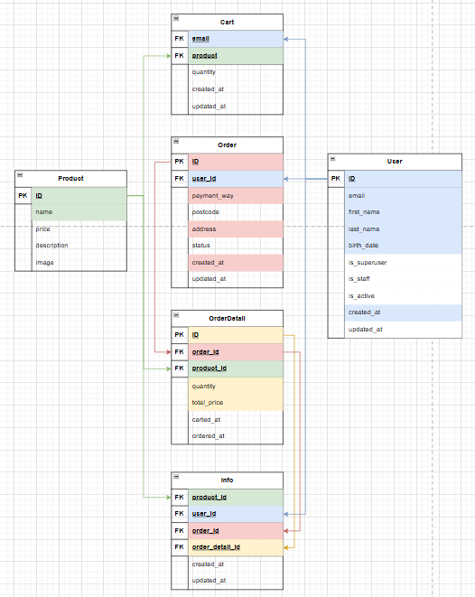

## Django アプリ（Django）

### コマンド

- 起動  
  `python3 manage.py runserver`

- Shell コマンド  
  `python manage.py shell`

- 管理者作成  
  `python3 manage.py createsuperuser`

## DB（Ecommerce）

MySQL を使用。ECSite

### コマンド

- マイグレーション  
  `python3 manage.py makemigrations`  
  `python3 manage.py migrate`

- 商品の追加  
  fixtures の JSON ファイルに追加して、  
  `python3 manage.py loaddata <fixturesのJSONファイル名>`

- ログイン  
  `mysql -u <ユーザ名> -p`  
  または管理者権限でログイン  
  `sudo mysql -u root`

- DB アクセス  
   mysql>  
   `USE <テーブル名>;`

- テーブル一覧表示  
  mysql>  
   `SHOW TABLES;`

- テーブルカラム表示  
  mysql>  
  `SHOW COLUMNS FROM <テーブル名>;`

- テーブルデータ表示  
  mysql>  
  `SELECT * FROM <テーブル名>;`

- DB 作成  
  mysql>  
  `CREATE DATABASE <DB名>;`

- ユーザ作成  
  mysql>  
  `CREATE USER '<ユーザ名>'@'localhost' IDENTIFIED BY '<パスワード>';`  
  `GRANT ALL ON <DB名>.\* TO '<ユーザ名>'@'localhost';`  
  `FLUSH PRIVILEGES;`

- テーブル削除  
  mysql>  
  `DROP DATABASE <テーブル名>;`

- テーブルデータ削除（オートインクリメントもリセット）  
  mysql>  
  `TRUNCATE TABLE <テーブルカラム名>;`

- テーブルデータ削除（オートインクリメントはそのまま）  
  mysql>  
  `DELETE FROM <テーブルカラム名>;`

- 退出  
  mysql>  
   `exit`

### ER 図

